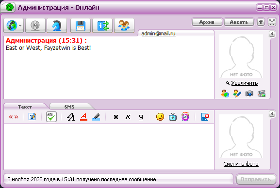

# Документация Aiomrim

Содержание:

[Начало](#Начало)

[Основные методы](#основные-методы)

[Примеры](#примеры)
- [Информация о людях, которые находятся в онлайне](#onlineget_online)
- [Регистрация аккаунта на сервере](#accountregister_account)
- [Проверка подключения к серверу](#check_connectioncheck_connection)
- [Отправка всем пользователям сообщения от имени администратора](#admin_sendannounce)

[Заключение](#заключение)

# Начало

В первую очередь, стоит начать с того, что **библиотека Aiomrim является асинхронной, и ее следует использовать, соотвественно, в асинхронных проектах на Python.** 

Установить Aiomrim можно следующей командой:
    
    pip install aiomrim

# Основные методы

| Метод | Описание метода | Аргументы | API метод |
| ------ | ----------- | ----------- | ---------- |
| online.get_online  | получение информации о пользователях, их количество и список пользователей | url: string | (GET) /users/online
| online.get_raw_online | по сути то же самое что и online.get_online, но еще и с технической информацией, включая IP и версию протокола | url: string | (GET) /users/rawOnline
| check_connection.check_connection   | проверка подключения к серверу (грубо говоря, ping-pong) | url: string | (GET) /heartbeat
| account.register_account | регистрация аккаунта на сервере | url: str, login: str, password: str, nickname: str, first_name: str, sex: int, last_name = None, location = None, birthday = None, status = None | (PUT) /users/register
| admin.send_announce | отправка сообщения от имени администратора всем пользователям инстанса (требует включенного админ-аккаунта в настройках самого MRIM-сервера) | url: str, message: str | (POST) /users/announce
| admin.send_mail_to_all | почти то же самое, что и admin.send_announce, но в виде пришедшего email. в большинстве случаев не имеет смысла, так как многие клиенты такое не обработают | url: str, message: str | (POST) /users/sendMailToAll

# Примеры

Рассмотрим основные примеры работы с Aiomrim. 

## online.get_online 
(информация о людях, которые находятся в онлайне)

```python
from aiomrim.online import get_online 
import asyncio 

async def getonline():
    url = 'http://127.0.0.1:1862' # url от MRIM-сервера
    result = await get_online(url)
    print(f'online users: {result}')

asyncio.run(getonline())
```

Получим подобный ответ:
```
online users: {'count': 1, 'users': 
[{'userId': 19, 'username': 'fayzetwin11', 
'status': 1, 'userAgent': 'client="magent" version="5.1" 
build="2190"', 'protocolVersion': 16}]}
```

## account.register_account
(регистрация аккаунта на сервере)

```python
from aiomrim.account import register_account
import asyncio 

async def reg_account():
    try:
        reg = await register_account(
            url='http://127.0.0.1:1862',
            
            login="fayzetwin", 
            nickname="fayzetwin", 
            first_name="fayzetwin",
            sex=1, # 1 - male, 2 - female
            password="my_great_password",
            
            last_name="User",
            birthday="1970-01-01", # YYYY-MM-DD format (DATE sql format)
        )
        print(f"Status: {reg}")
    except Exception as e:
        print(f"Error registering account: {e}")
        
asyncio.run(reg_account())
```

Получим подобный ответ: 
```
Status: {'status': 'ok'}
```

## check_connection.check_connection
(проверка подключения к серверу)

```python
import asyncio
from aiomrim.check_connection import check_connection

async def checkconnect():
    url = 'http://127.0.0.1:1862'
    result = await check_connection(url)
    print(f'result: {result}')

asyncio.run(checkconnect())
```

Получим подобный ответ:

```
result: True
```

## admin_send.announce
(отправить всем пользователям сервера сообщение от имени администратора)

```python
import asyncio
from aiomrim.admin import send_announce

async def announce():
    url = 'http://127.0.0.1:1862'
    result = await send_announce(url, message="East or West, Fayzetwin is Best!")
    print(f'result: {result}')

asyncio.run(announce())
```

И как видим, оно работает:



А ответ получим следующий:
```
result: {'status': 'ok', 'users': 1}
```

# Заключение

Библиотека Aiomrim будет (пока что) **разрабатываться и пополнять свой функционал соотвественно функционалу [Renaissance](https://github.com/mrimsu/mrim-server) и его [API](https://github.com/mrimsu/mrim-server/blob/main/docs/rest.md).** 

Если вам понравилась эта библиотека, то можете **поставить звезду репозиторию (честно, я буду рад ^_^), или заценить другие мои проекты.** 

**Удачи в использовании!** ❤️